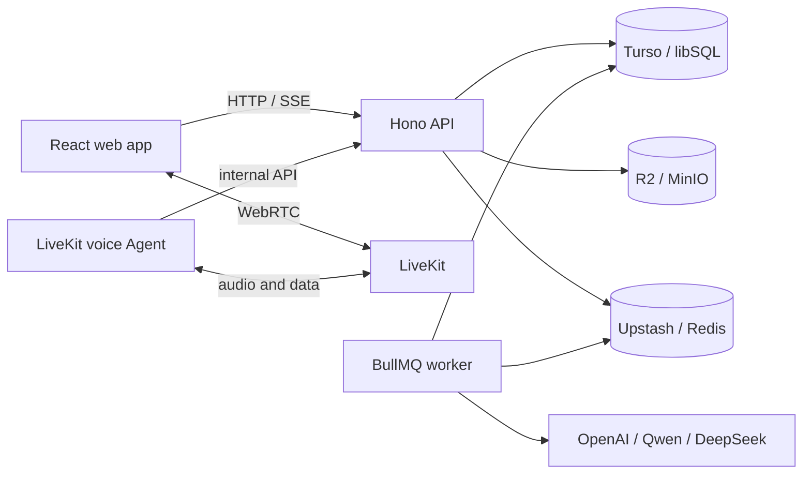

# English Speaking Coach

English Speaking Coach is a full-stack, AI-assisted language-learning platform
for realistic spoken-English practice. It combines low-latency voice
conversation with reusable scenarios, structured learning material, persistent
practice history, and asynchronous feedback.

The repository is both a working personal learning tool and a reference
implementation for developers interested in production-oriented voice AI,
multi-model orchestration, and TypeScript monorepo architecture.

## Product experience

- Practise spoken English in real time with an interruptible LiveKit voice Agent
- Create reusable scenarios with separate story, learning-goal, and dialogue
  generation stages
- Organise knowledge items and track their use across practice sessions
- Review linguistic and conversational analysis after a session
- Keep practice history available across local and deployed environments
- Manage users, generation jobs, model requests, and failures through
  administrative views

## Engineering highlights

- **Realtime voice pipeline:** Deepgram Flux STT, a non-thinking DeepSeek
  conversation model, and Cartesia Sonic TTS, connected through LiveKit Agents
- **Fine-grained model routing:** OpenAI, Qwen, and DeepSeek can be selected
  independently for knowledge generation, linguistic analysis, conversation
  analysis, and each scenario-generation stage
- **Asynchronous processing:** BullMQ workers keep generation and analysis work
  outside latency-sensitive API and voice paths
- **Shared contracts:** Zod schemas and workspace packages keep the React client,
  Hono backend, and Agent aligned
- **Portable infrastructure:** local Docker services for development and managed
  Turso, Upstash, Cloudflare R2, LiveKit Cloud, Fly.io, and Vercel for shared
  practice
- **Quality gates:** TypeScript, Biome, Vitest, Turborepo caching, and
  change-aware GitHub Actions

## Architecture



## Technology

| Area | Stack |
| --- | --- |
| Web | React 19, Vite, TanStack Router and Query, Tailwind CSS |
| API | Hono, Bun, Better Auth |
| Voice Agent | LiveKit Agents for Node.js |
| Data | Drizzle ORM, libSQL/Turso |
| Jobs | BullMQ, Redis/Upstash |
| Storage | S3-compatible MinIO/Cloudflare R2 |
| Monorepo | pnpm workspaces, Turborepo, TypeScript |
| Testing and quality | Vitest, Bun Test, Biome, GitHub Actions |

## Repository layout

```text
apps/
  web/       React browser application
  backend/   Hono API and BullMQ worker
  agent/     LiveKit voice Agent
packages/
  contract/  Shared API contracts and validation schemas
  database/  Drizzle schema, migrations, and libSQL client
  domain/    Shared domain constants and types
  prompts/   Generation and analysis prompts
  storage/   S3-compatible object storage
  ui/        Shared React components
```

## Develop locally

### Prerequisites

- Node.js 20 or newer; the latest LTS through
  [fnm](https://github.com/Schniz/fnm) is recommended
- pnpm 10 or newer
- [Bun](https://bun.sh/)
- Docker with Docker Compose

Install dependencies and create local configuration:

```sh
pnpm install
cp apps/backend/.env.example apps/backend/.env.local
cp apps/agent/.env.example apps/agent/.env.local
cp apps/web/.env.example apps/web/.env.local
```

The committed examples provide safe local infrastructure defaults and document
the credentials that still need to be supplied. Add provider credentials for
the AI routes you intend to exercise; never commit `.env.local` files.

Start LiveKit, Redis, MinIO, the web app, API, and worker:

```sh
pnpm run dev:full
```

Run the voice Agent in another terminal:

```sh
pnpm run dev:agent
```

Local endpoints:

| Service | Address |
| --- | --- |
| Web | `http://localhost:5173` |
| API | `http://localhost:3001` |
| LiveKit | `ws://localhost:7880` |
| Redis | `redis://localhost:6379` |
| MinIO API | `http://localhost:9000` |
| MinIO console | `http://localhost:9001` |

## Environment profiles

The project supports two local workflows:

- `pnpm run dev:development` selects local-service configuration for feature
  development and runs the Agent against the local LiveKit server.
- `pnpm run dev:practice` selects cloud-backed configuration so practice data is
  available from multiple computers, and runs the Agent locally so it can call
  the local backend directly. The LiveKit Cloud Agent deployment is not used by
  this command.

Create the ignored `.env.development.local` and `.env.practice.local` files for
the backend and Agent before using these commands. The profile script copies the
selected values into each app's `.env.local`.

Each environment example documents only the variables owned by that component:

- [`apps/backend/.env.example`](apps/backend/.env.example)
- [`apps/agent/.env.example`](apps/agent/.env.example)
- [`apps/web/.env.example`](apps/web/.env.example)
- [`packages/database/.env.example`](packages/database/.env.example)

## Useful commands

```sh
pnpm run build
pnpm run test
pnpm run lint
pnpm run format-and-lint
pnpm run format-and-lint:fix
pnpm run db:generate
pnpm run db:push
pnpm run infra:up
pnpm run infra:down
```

Before opening a pull request:

```sh
pnpm run format-and-lint:fix
pnpm run build
pnpm run test
```

## Deployment

The reference deployment uses Vercel for the web app, Fly.io for the API and
worker, LiveKit Cloud for the Agent, Turso for the database, Upstash for Redis,
and Cloudflare R2 for object storage.

GitHub Actions validates pull requests and deploys only affected services after
changes reach `main`. See the
[deployment guide](docs/deployment.md) for account setup, secrets, environment
variables, and deployment commands.

The hosted instance is intentionally a personal environment and discourages
search-engine indexing. Developers should deploy their own infrastructure and
credentials rather than rely on that instance.

## Extending the project

Good starting points include:

- adding a model provider in
  [`apps/backend/src/lib/ai/registry.ts`](apps/backend/src/lib/ai/registry.ts)
- changing asynchronous model routes in
  [`apps/backend/src/lib/ai/model-config.ts`](apps/backend/src/lib/ai/model-config.ts)
- adapting voice models and turn handling in
  [`apps/agent/src/voice-models.ts`](apps/agent/src/voice-models.ts)
- creating new learning workflows under
  [`apps/web/src/features`](apps/web/src/features)
- evolving shared schemas in [`packages/contract`](packages/contract)

Contributions and experiments are welcome. Please keep provider credentials out
of Git and include tests for behavior changes, especially changes to the voice
Agent.
